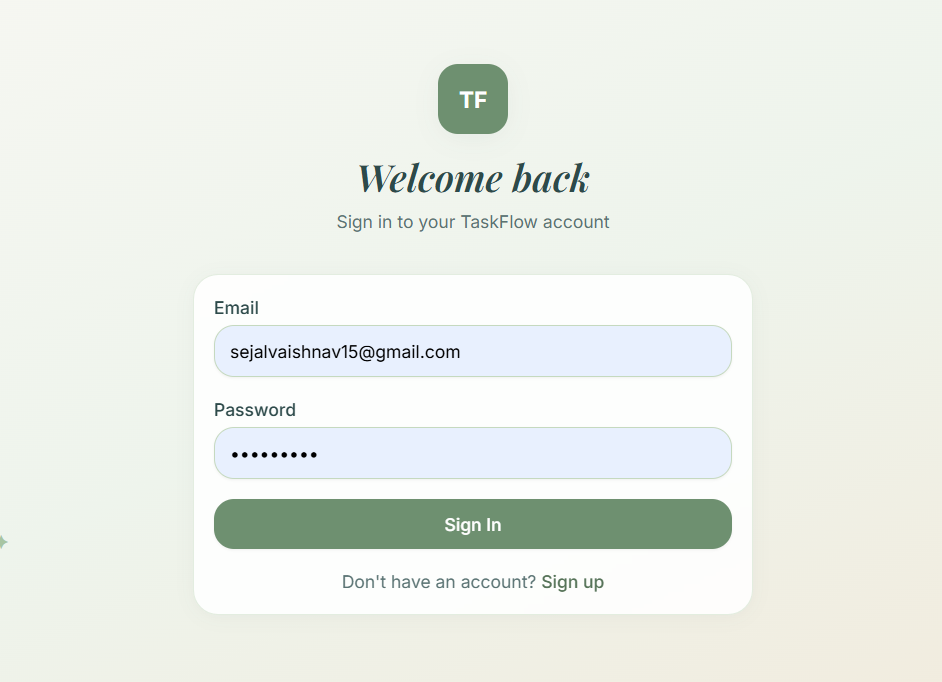
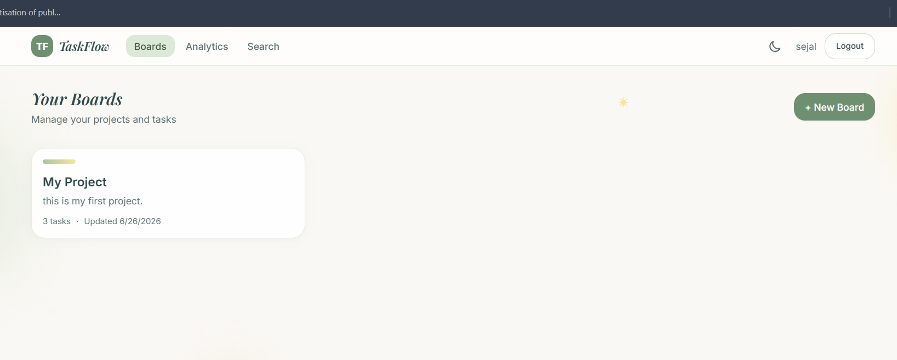
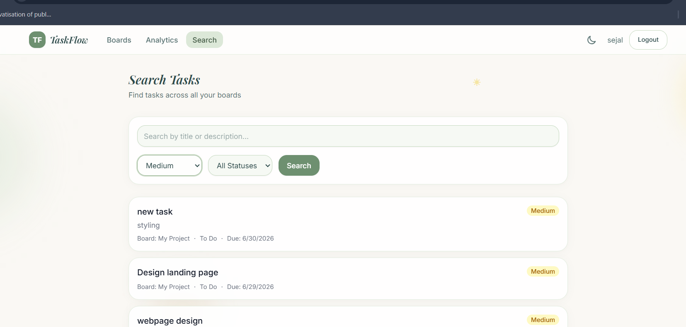
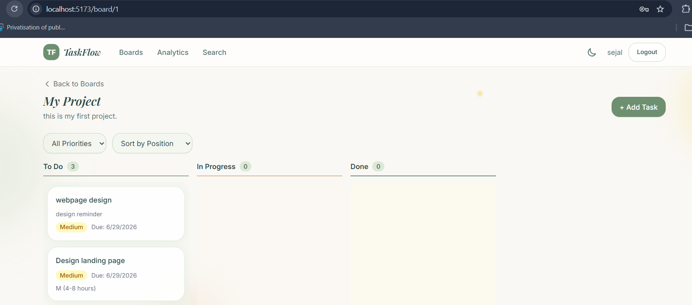
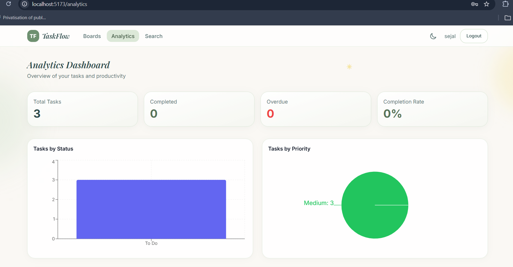
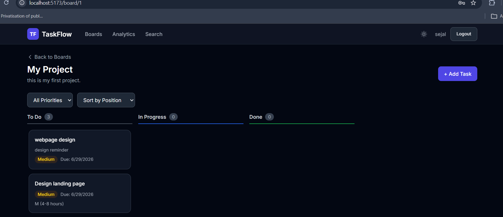

# TaskFlow - Smart Task & Project Manager

A full-stack task and project management application built as a lightweight Trello/Asana alternative with AI-powered task assistance.

## Features

### Core
- **Authentication** — Register, login, JWT-based sessions with bcrypt password hashing
- **Boards** — Create, rename, delete project boards with ownership enforcement
- **Kanban Board** — To Do / In Progress / Done columns with drag-and-drop
- **Tasks** — Full CRUD with priority, due dates, effort estimates, filters & sorting
- **AI Assist** — Smart due-date & effort estimate suggestions via Google Gemini API
- **Dark/Light Mode** — Theme toggle with persisted preference
- **Responsive UI** — Mobile, tablet, and desktop layouts

### Bonus Features
- **TypeScript** — Backend written in TypeScript
- **TanStack Query** — Server-state management with caching
- **Drag-and-Drop** — Smooth column moves via @dnd-kit
- **express-validator** — Server-side input validation
- **Recharts Dashboard** — Analytics with status/priority charts
- **Activity Log** — Tracks task/board changes

### Bonus Challenges (3 implemented)
1. **More AI** — Natural-language task input + auto-suggest subtasks
2. **Drag-and-Drop** — Move tasks between columns with dnd-kit
3. **Dashboard/Analytics** — Charts for tasks by status, priority, overdue count
4. **Search & Filters** — Global task search with multiple filters

## Tech Stack

| Layer | Technology |
|-------|-----------|
| Frontend | React 18, TypeScript, Vite, React Router, Tailwind CSS |
| HTTP Client | Fetch API |
| State | TanStack Query |
| Backend | Node.js, Express, TypeScript |
| Database | MySQL 8 |
| Auth | JWT + bcrypt |
| AI | Google Gemini 2.0 Flash (free tier) |
| Charts | Recharts |
| DnD | @dnd-kit |

## Project Structure

```
taskflow/
├── backend/          # Express REST API
│   └── src/
│       ├── config/       # DB & env config
│       ├── controllers/  # Route handlers
│       ├── database/     # Schema & init script
│       ├── middleware/   # Auth, validation, errors
│       ├── routes/       # API routes
│       └── services/     # AI service
├── frontend/         # React SPA
│   └── src/
│       ├── components/   # Reusable UI components
│       ├── context/      # Auth & theme providers
│       ├── pages/        # Route pages
│       ├── services/     # Fetch API client
│       └── types/        # TypeScript interfaces
└── docker-compose.yml    # MySQL container
```

## Getting Started

### Prerequisites
- Node.js 18+
- MySQL 8 (or Docker)

### 1. Start MySQL

**Option A — Docker:**
```bash
docker-compose up -d
```

**Option B — Local MySQL:**
Create a database named `taskflow` and run the schema:
```bash
mysql -u root -p < backend/src/database/schema.sql
```

### 2. Backend Setup

```bash
cd backend
cp .env.example .env
# Edit .env with your MySQL credentials and optional GEMINI_API_KEY
npm install
npm run db:init    # Initialize database tables
npm run dev        # Starts on http://localhost:5000
```

### 3. Frontend Setup

```bash
cd frontend
cp .env.example .env
npm install
npm run dev        # Starts on http://localhost:5173
```

### Environment Variables

**Backend (`backend/.env`):**
| Variable | Description |
|----------|-------------|
| `PORT` | API server port (default: 5000) |
| `DB_HOST` | MySQL host |
| `DB_PORT` | MySQL port |
| `DB_USER` | MySQL username |
| `DB_PASSWORD` | MySQL password |
| `DB_NAME` | Database name |
| `JWT_SECRET` | Secret for signing JWTs |
| `JWT_EXPIRES_IN` | Token expiry (default: 7d) |
| `GEMINI_API_KEY` | Google Gemini API key (optional) |
| `CLIENT_URL` | Frontend URL for CORS |

**Frontend (`frontend/.env`):**
| Variable | Description |
|----------|-------------|
| `VITE_API_URL` | Backend API URL (default: `/api` via Vite proxy) |

## AI Feature

TaskFlow uses **Google Gemini 2.0 Flash** for:
- **Suggest Estimate** — Analyzes task title/description and returns effort estimate + due date
- **Natural Language Input** — Parses free-text like "Fix login bug by Friday, high priority"
- **Suggest Subtasks** — Breaks a task into 3-5 actionable subtasks

The LLM API key is stored server-side only. If no key is configured, the app returns sensible fallback responses so all features remain demonstrable.

Get a free API key at: https://aistudio.google.com/apikey

## API Documentation

### Auth
| Method | Endpoint | Description |
|--------|----------|-------------|
| POST | `/api/auth/register` | Register new user |
| POST | `/api/auth/login` | Login, returns JWT |
| GET | `/api/auth/me` | Get current user (protected) |

### Boards
| Method | Endpoint | Description |
|--------|----------|-------------|
| GET | `/api/boards` | List user's boards |
| GET | `/api/boards/:id` | Get single board |
| POST | `/api/boards` | Create board |
| PUT | `/api/boards/:id` | Update board |
| DELETE | `/api/boards/:id` | Delete board |

### Tasks
| Method | Endpoint | Description |
|--------|----------|-------------|
| GET | `/api/tasks/:boardId/tasks` | List board tasks (filter/sort) |
| POST | `/api/tasks/:boardId/tasks` | Create task |
| PUT | `/api/tasks/:id` | Update task |
| PATCH | `/api/tasks/:id/move` | Move task between columns |
| DELETE | `/api/tasks/:id` | Delete task |
| GET | `/api/tasks/search` | Global task search |

### AI
| Method | Endpoint | Description |
|--------|----------|-------------|
| POST | `/api/ai/suggest-estimate` | Get effort/due-date suggestion |
| POST | `/api/ai/natural-language` | Parse natural language task |
| POST | `/api/ai/suggest-subtasks` | Get subtask suggestions |

### Analytics
| Method | Endpoint | Description |
|--------|----------|-------------|
| GET | `/api/analytics/dashboard` | Dashboard stats & charts data |

## Deployment

- **Frontend:** Deploy to Vercel (set `VITE_API_URL` to your backend URL)
- **Backend:** Deploy to Railway
- **Database:** Use a free hosted MySQL (Railway)

## Live Demo

- **Frontend:** https://taskflow-project-sejal3.vercel.app
- **Backend API:** https://taskflowproject-production-5e19.up.railway.app/api/health
- **Database:** Railway MySQL (hosted)

### Demo credentials
- Email: `sejalvaishnav15@gmail.com`
- Password: `sejalvsnv`

## Project Screenshots

### 🔐 Login Page


### 📋 Dashboard


### 🔍 Search Page


### ✅ Task Page


### 📊 Analytics Page


### 🌙 Dark Mode


## Known Limitations

- No real-time collaboration (single-user boards)
- Subtasks are suggested but not persisted as separate entities
- No email notifications
- AI responses depend on free-tier API availability

## License

MIT
